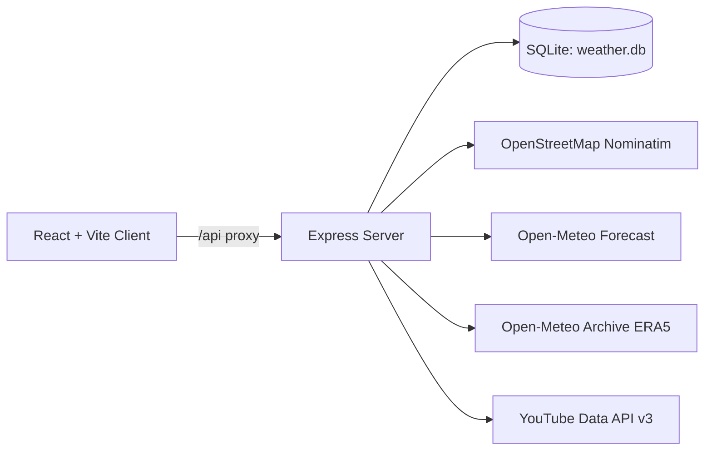

## SkyCastTube: Weather Intelligence Dashboard


SkyCastTube is a full‑stack weather and media dashboard that lets you search any location, view current conditions and a 5‑day outlook, save queries to a local database, and export your data in multiple formats. It also surfaces weather‑related YouTube videos for the selected location.

This project was created as an assignment for the Product Manager Accelerator (PMA) Program.

### Table of contents
- **Features**
- **Tech stack**
- **Architecture**
- **Project structure**
- **Server APIs**
- **Database schema**
- **Local development**
- **Environment variables**
- **Exports**
- **Attribution**

## Features
- **Location search**: Geocode free‑form text or use your device location.
- **Current weather + 5‑day forecast**: Powered by Open‑Meteo, with iconized daily summaries.
- **Interactive map**: Leaflet map centers on the resolved location.
- **Saved records**: Persist location queries, coordinates, date range, and summarized weather to SQLite.
- **Filtering and editing**: Search, edit, and update saved records in place.
- **Multi‑format export**: JSON, CSV, XML, Markdown, and PDF.
- **Media tab**: Weather‑related YouTube videos for the current location (optional API key).
- **Modern UI**: React + Vite, dark/light theme toggle, glassy panels, responsive layout.

## Tech stack
- **Frontend**: React 19, TypeScript, Vite, React‑Leaflet, Axios
- **Backend**: Node.js, Express, better‑sqlite3, Axios, PDFKit, xmlbuilder2, CORS, dotenv
- **Database**: SQLite (file‑based, WAL mode) under `data/weather.db`
- **External APIs**:
  - OpenStreetMap Nominatim (geocoding and reverse geocoding)
  - Open‑Meteo Forecast API (current and forecast data)
  - Open‑Meteo Archive ERA5 API (historical data)
  - YouTube Data API v3 (optional; for videos)

## Architecture


## Project structure
```
weatherapp_PMA_AI_intern/
├─ client/                     # React + TS + Vite frontend
│  ├─ src/
│  │  ├─ App.tsx              # App shell, tabs, theme toggle, Info modal
│  │  ├─ api.ts               # Typed Axios API client
│  │  ├─ components/
│  │  │  ├─ WeatherSearch.tsx # Search bar, date controls, forecast + map, YouTube embed
│  │  │  ├─ RecordsTable.tsx  # Saved queries list with inline edit + export links
│  │  │  ├─ MapView.tsx       # React-Leaflet map with pin + popup
│  │  │  ├─ YouTubeSearch.tsx # Grid of videos for a location
│  │  │  └─ YouTubeVideosTab.tsx # Standalone video search tab
│  │  ├─ App.css              # Component styles & tokens (panels, buttons, tables)
│  │  ├─ index.css            # Global theme tokens, backgrounds, resets
│  │  └─ main.tsx             # App bootstrap
│  ├─ vite.config.ts          # Dev proxy to http://localhost:3001
│  └─ package.json
├─ server/                    # Express backend
│  ├─ index.js                # Routes, DB setup, exports
│  └─ package.json
├─ data/
│  └─ weather.db              # SQLite database (auto-created)
└─ README.md
```

## Server APIs

Base URL: `http://localhost:3001`

### Health
| Method | Path         | Description           |
|-------:|--------------|-----------------------|
| GET    | `/api/health`| Simple health check   |

### Geocoding
| Method | Path           | Query Params                 | Description                       |
|-------:|----------------|------------------------------|-----------------------------------|
| GET    | `/api/geocode` | `q` string                   | Forward geocode free‑form text    |
| GET    | `/api/geocode` | `lat` number, `lon` number   | Reverse geocode coordinates       |

### Weather (stateless)
| Method | Path                    | Query Params                  | Description                 |
|-------:|-------------------------|-------------------------------|-----------------------------|
| GET    | `/api/weather/current`  | `lat`, `lon`                  | Current weather             |
| GET    | `/api/weather/forecast5`| `lat`, `lon`                  | 5‑day forecast (daily view) |

### Records (persisted)
| Method | Path                | Body/Query                                 | Description                                   |
|-------:|---------------------|--------------------------------------------|-----------------------------------------------|
| POST   | `/api/records`      | `{ inputText?, latitude?, longitude?, startDate, endDate }` | Create a record, geocode + fetch data         |
| GET    | `/api/records`      | `q?`                                       | List all records (search optional)            |
| GET    | `/api/records/:id`  | —                                          | Get a single record                           |
| PUT    | `/api/records/:id`  | Partial body of POST                        | Update fields, re‑geocode and re‑fetch data   |
| DELETE | `/api/records/:id`  | —                                          | Delete a record (cascades weather data)       |

### Exports
| Method | Path                   | Query Params                                  | Description                      |
|-------:|------------------------|-----------------------------------------------|----------------------------------|
| GET    | `/api/records/export`  | `format` one of `json,csv,xml,md,pdf`; `id?`  | Export one or all saved records  |

### Media (optional)
| Method | Path                 | Query Params | Description                                   |
|-------:|----------------------|--------------|-----------------------------------------------|
| GET    | `/api/media/youtube` | `q`          | Weather‑related videos (requires API key)     |

## Database schema (SQLite)
The database file lives in `data/weather.db` and is created automatically on server start.

```sql
CREATE TABLE IF NOT EXISTS queries (
  id INTEGER PRIMARY KEY AUTOINCREMENT,
  input_text TEXT,
  resolved_name TEXT NOT NULL,
  latitude REAL NOT NULL,
  longitude REAL NOT NULL,
  start_date TEXT NOT NULL,
  end_date TEXT NOT NULL,
  source TEXT NOT NULL,
  created_at TEXT NOT NULL,
  updated_at TEXT NOT NULL
);

CREATE TABLE IF NOT EXISTS weather_data (
  id INTEGER PRIMARY KEY AUTOINCREMENT,
  query_id INTEGER NOT NULL,
  data_json TEXT NOT NULL,
  created_at TEXT NOT NULL,
  FOREIGN KEY (query_id) REFERENCES queries(id) ON DELETE CASCADE
);
```

## Local development

### Prerequisites
- Node.js 18+ (recommended 20+)
- npm 9+

### 1) Start the API server
```bash
cd server
npm install
cp .env.example .env  # optional; see Environment Variables below
npm run dev           # starts on http://localhost:3001
```

### 2) Start the web client
```bash
cd ../client
npm install
npm run dev           # opens http://localhost:5173 (proxy to /api → 3001)
```

### Build for production
```bash
# Client (build into client/dist)
cd client && npm run build

# Server (simple Node server)
cd ../server && npm start
```

## Environment variables
Create `server/.env` (optional) to enable YouTube videos and change port.

```env
# server/.env
PORT=3001
YOUTUBE_API_KEY=YOUR_YOUTUBE_DATA_API_V3_KEY
```

If `YOUTUBE_API_KEY` is not set, the media route responds with an empty list and a note.

## Exports and formats
- JSON: machine‑readable, pretty‑printed
- CSV: single row per record with a compact daily summary
- XML: hierarchical structure suitable for systems integration
- Markdown: GitHub‑friendly table with inline summaries
- PDF: nicely formatted, multi‑page export via PDFKit

Download links are available in the UI under the Saved table. You can also hit the HTTP endpoint directly, for example:

```bash
curl -L "http://localhost:3001/api/records/export?format=csv"
curl -L "http://localhost:3001/api/records/export?format=pdf&id=1" --output weather-record-1.pdf
```

## Notes on code organization
- **`client/src/components/WeatherSearch.tsx`**: orchestrates geocoding, current weather, and forecast; saves records; renders forecast cards and embeds the map and videos.
- **`client/src/components/RecordsTable.tsx`**: fetches, searches, edits, updates, deletes, and exports saved records.
- **`client/src/components/MapView.tsx`**: Leaflet map with a fixed marker icon compatible with Vite bundling.
- **`client/src/components/YouTubeSearch.tsx`**: fetches and shows a responsive grid of video cards.
- **`server/index.js`**: Express routes, DB setup, Open‑Meteo/Nominatim/YT integration, and export utilities (CSV, XML, MD, PDF).

## Attribution
- Geocoding by **OpenStreetMap Nominatim** (`https://nominatim.openstreetmap.org`)
- Weather data by **Open‑Meteo** (`https://open-meteo.com`)
- Map tiles by **OpenStreetMap** contributors
- Optional videos by **YouTube Data API v3**

— Built as an assignment for the **Product Manager Accelerator (PMA) Program**.


